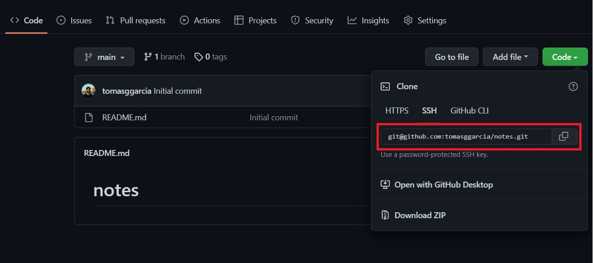
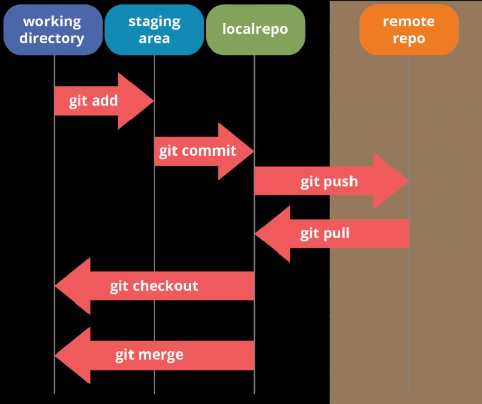
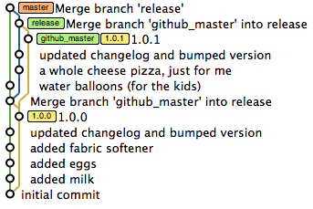

# Start using git with only 6 Commands


If you are a new developer you surely heard about version control systems and GIT. <br>
When you are coding you'll need some way to track the changes in your code to keep a history, especially if you are working in a team. <br>
So in this post I will share the few indispensable GIT commands you should know to start using this amazing tool.

# Table of Contents
1. [pull](#example)
2. [add](#example)
3. [commit](#example2)
4. [checkout](#third-example)
5. [merge](#fourth-examplehttpwwwfourthexamplecom)
6. [push](#fourth-examplehttpwwwfourthexamplecom)

<br>

## Pull
First of all you can create a repository in code hosting platform (in this case I'll use Github).
After that you will see something like this:



Then you should copy that ssh URL and we will see our first git command:

```git pull git@github.com:tomasggarcia/notes.git```

If you have never configured your ssh keys with Github, you can check out this documentation:

https://docs.github.com/es/authentication/connecting-to-github-with-ssh

Git pull is used to synchronize the remote version of a repository with your local one. If the repository does not exist locally, it will 'copy' the repository in a local folder.
Once we get the repository, you can start working in your code. 


## ADD

At some point you'll find that you made significant changes and you don't want to lose them. 
So we need to tell GIT to save these changes. First of all we'll say to him what changes we want to ADD to the history.
In this case we'll use the command 'git add'. It can be used with a specific file:

```
git add main.js
git add README.md
```

Or if we want to add all the changed files to be committed, we will use:

```
git add .
```

Here I think is important to see the different stages that your changes will have, working with git:


## Commit 

So, now that we select which files we want to save, we need to COMMIT these files.
Committing is used to tell git that the changes you added to the staging area will be 'packing' in the same block unit. We will commit with a specific name so later we can se all commits sequentially as a tree.
For example:



Every dot in the image is a commit while each color line specifies a BRANCH, we will look for a little bit more of this last term in the next command.
To make a commitment we will use the third command:

```
git commit -m "commit message"
```

## Checkout

A BRANCH represents an independent line of development. Each branch can have it's own commits.
To switch between branches, we will use the command:
```
git checkout BRANCH_NAME
```

This command is useful also to changes between COMMITS, for example:
```
git checkout f94ccbb
```
Where 'f94ccbb' are the first characters of the COMMIT ID (in this example the full commit ID is: f94ccbbe65afe48c4548fb4f62dc2cace8394759)

## Merge

If we are working with different branches, after doing some commits in a specific branch, we will probably want to merge these changes with another branch. To give a simple example, if we are working in a feature branch called "footer" and we want to bring that changes to "development" branch, we need first to point to this last branch ('git checkout development' if we are in a different branch) and use:
```
git merge footer
```
After that merge, the "footer" and "development" branches will have the same code.


## Push
At last, we will want to upload these new commits to your repository hosting service (in this case Github) to save them, or if you're working in a team, to be accessed to the rest of the team.
So our last command is:
```
git push development
```

### There are a lot of other commands to know in order to have a good workflow with GIT, but I think with this few you can start using it and taking advantage of the benefits that it provides to us.