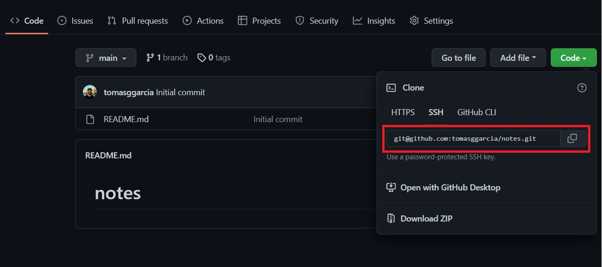
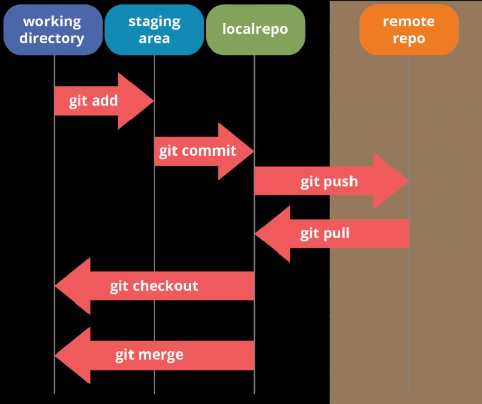

Start using git with only 6 Commands

If you are a new developer you surely heard about version control systems and GIT.
When you are coding you'll need some way to track the changes in your code to keep a history, especially if you are working in a team.
So in this post I will share the few indispensable GIT commands you should know to start using this amazing tool:

First of all you probably create a repository in code hosting platform (in this case I'll use Github).
After that you will see something like this:



Then you should copy that ssh URL and we will see our first git command:

```git pull git@github.com:tomasggarcia/notes.git```

Git pull is used to syncronize the remote version of a repository with your local one. In this case if the repository does not exist, it will 'copy' the repository in a local folder.
Once we get the repository you can start working in your code. 

At some point you'll find that you made significant changes and you don't want to lose. 
So we need to tell GIT to save this changes. First of all we'll say to him what changes we want to ADD to the history.
In this case we'll use the command 'git add'. It can be used with a specific file:

```
git add main.js
git add README.md
```

Or if we want to add all the changed files to be committed, we will use:

```
git add .
```

So, now we select wich files we want to save, no we need to COMMIT these files.





git pull
git push
git add
git commit -m
git checkout
git merge
